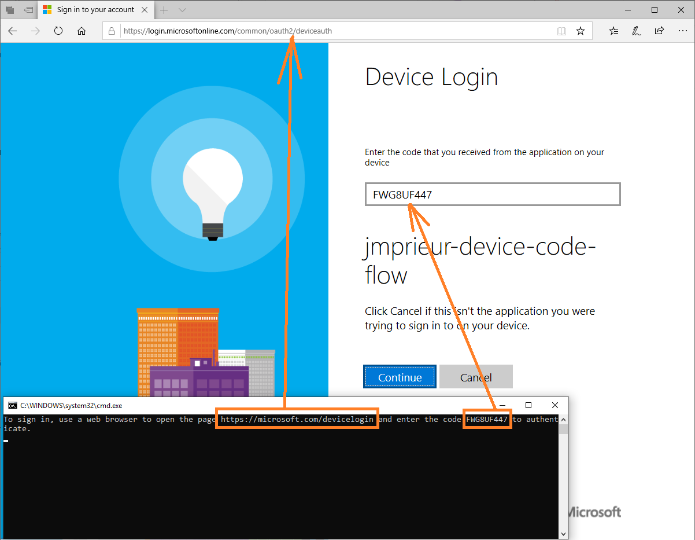

# A simple Python device code flow application calling Microsoft Graph

## About this sample

### Overview

This sample application shows how to use the [Microsoft identity platform endpoint](http://aka.ms/aadv2) to access the data of Microsoft customers.  The device code flow can be used to authenticate a user and then call to a web api, in this case, the [Microsoft Graph](https://graph.microsoft.io).

The app can run as a Python Console Application. It gets the list of users in an Azure AD tenant by using `Microsoft Authentication Library (MSAL) for Python` to acquire a token.

## Scenario

The application obtains tokens through a two steps process especially designed for devices and operating systems that cannot display any UX. Examples of such applications are applications running on iOT, or Command-Line tools (CLI). The idea is that:


1. Whenever a user authentication is required, the command-line app provides a code and asks the user to use another device (such as an internet-connected smartphone) to navigate to https://microsoft.com/devicelogin, where the user will be prompted to enter the code. That done, the web page will lead the user through a normal authentication experience, including consent prompts and multi factor authentication if necessary.



1. Upon successful authentication, the command-line app will receive the required tokens through a back channel and will use it to perform the web API calls it needs. In this case, the sample displays information about the user who signed-in and their manager.

## How to run this sample

To run this sample, you'll need:

> - [Python 2.7+](https://www.python.org/downloads/release/python-2713/) or [Python 3+](https://www.python.org/downloads/release/python-364/)
> - An Azure Active Directory (Azure AD) tenant. For more information on how to get an Azure AD tenant, see [how to get an Azure AD tenant.](https://docs.microsoft.com/azure/active-directory/develop/quickstart-create-new-tenant)

### Step 1:  Clone or download this repository

From your shell or command line:

```Shell
git clone https://github.com/Azure-Samples/ms-identity-python-devicecodeflow.git
```

### Step 2:  Register the sample with your Azure Active Directory tenant

Some registration is required for Microsoft to act as an authority for your application.

#### Choose the Azure AD tenant where you want to create your applications

1. Sign in to the [Azure portal](https://portal.azure.com).
> If your account is present in more than one Azure AD tenant, select `Directory + Subscription`, which is an icon of a notebook with a filter next to the alert icon, and switch your portal session to the desired Azure AD tenant.
2. Select **Azure Active Directory** from the left nav.
3. Select **App registrations** from the new nav blade.

#### Register the client app

1. In **App registrations** page, select **New registration**.
1. When the **Register an application page** appears, enter your application's registration information:
   - In the **Name** section, enter a meaningful application name that will be displayed to users of the app, for example `device-code-sample`.
   - In the **Supported account types** section, select the last option **Accounts in any organizational directory and personal Microsoft accounts**.
   - Device Code Flow disables the need for a redirect URI. Leave it blank.
1. Select **Register** to create the application.
1. On the app **Overview** page, find the **Application (client) ID** value and copy it to your *parameters.json* file's *client_id* entry.
1. In **Authentication* select the recommended Redirect URIs for public clients.
1. Then set the Default Client Type to `Yes` and Save.

1. In the list of pages for the app, select **API permissions**
   - Click the **Add a permission** button and then,
   - Ensure that the **Microsoft APIs** tab is selected
   - In the *Commonly used Microsoft APIs* section, click on **Microsoft Graph**
   - In the **Delegated permissions** section, ensure that the right permissions are checked: **User.Read**. Use the search box if necessary.
   - Select the **Add permissions** button


### Step 3: Run the sample

You'll need to install the dependencies using pip as follows:

```Shell
pip install msal requests
```

Start the application, follow the instructions and use a browser to authenticate. The profile for the user you log in with will display in the console.

```Shell
python device_flow_sample.py parameters.json
```
If the sample fails to run or is outdated, you can try installing the version specific dependencies from requirements.txt.

```Shell
pip install -r requirements.txt
```

If that doesn't fix the issue, ensure that your parameters.json is correct and saved.

## About the code

The relevant code for this sample is in the `device_code_sample.py` file. The steps are:

1. Create the MSAL Device Code flow application.


    ```Python
    app = msal.PublicClientApplication(
      config["client_id"], authority=config["authority"],
    )
    ```

2. The scopes are defined in the parameters.json file.

   In the default parameters.json file you have:

    ```JSon
    "scope": ["User.Read"]
    ```

3. Acquire the token

    ```Python
    result = None
    # Firstly, looks up a token from cache
    # If that fails, attempt the device code flow
    accounts = app.get_accounts()
    # Skipping account iteration and cache lookup
    flow = app.initiate_device_flow(scopes=config["scope"])
    # Skipping error condition
    result = app.acquire_token_by_device_flow(flow)
    ```

4. Call the API

    In that case calling "https://graph.microsoft.com/v1.0/me" with the access token as a bearer token.

    ```Python
    if "access_token" in result:
        # Calling graph using the access token
        graph_data = requests.get(  # Use token to call downstream service
        config["endpoint"],
        headers={'Authorization': 'Bearer ' + result['access_token']}, ).json()
    print("Users from graph: " + str(graph_data))
    else:
        print(result.get("error"))
        print(result.get("error_description"))
        print(result.get("correlation_id"))  # You may need this when reporting a bug
    ```

## Troubleshooting


## Community Help and Support

Use [Stack Overflow](http://stackoverflow.com/questions/tagged/msal) to get support from the community.
Ask your questions on Stack Overflow first and browse existing issues to see if someone has asked your question before.
Make sure that your questions or comments are tagged with [`msal` `python`].

If you find a bug in the sample, please raise the issue on [GitHub Issues](../../issues).

If you find a bug in Msal Python, please raise the issue on [MSAL Python GitHub Issues](https://github.com/AzureAD/microsoft-authentication-library-for-python/issues).

To provide a recommendation, visit the following [User Voice page](https://feedback.azure.com/forums/169401-azure-active-directory).

## Contributing

If you'd like to contribute to this sample, see [CONTRIBUTING.MD](/CONTRIBUTING.md).

This project has adopted the [Microsoft Open Source Code of Conduct](https://opensource.microsoft.com/codeofconduct/). For more information, see the [Code of Conduct FAQ](https://opensource.microsoft.com/codeofconduct/faq/) or contact [opencode@microsoft.com](mailto:opencode@microsoft.com) with any additional questions or comments.

## More information

For more information, see MSAL Python's conceptual documentation:

- [Quickstart: Register an application with the Microsoft identity platform](https://docs.microsoft.com/azure/active-directory/develop/quickstart-register-app)
- [Quickstart: Configure a client application to access web APIs](https://docs.microsoft.com/azure/active-directory/develop/quickstart-configure-app-access-web-apis)
- [Device Code Flow app scenario](https://docs.microsoft.com/en-us/azure/active-directory/develop/msal-authentication-flows#device-code)

For more information about the underlying protocol:

- [Microsoft identity platform and the OAuth 2.0 device code flow](https://docs.microsoft.com/en-us/azure/active-directory/develop/v2-oauth2-device-code)
